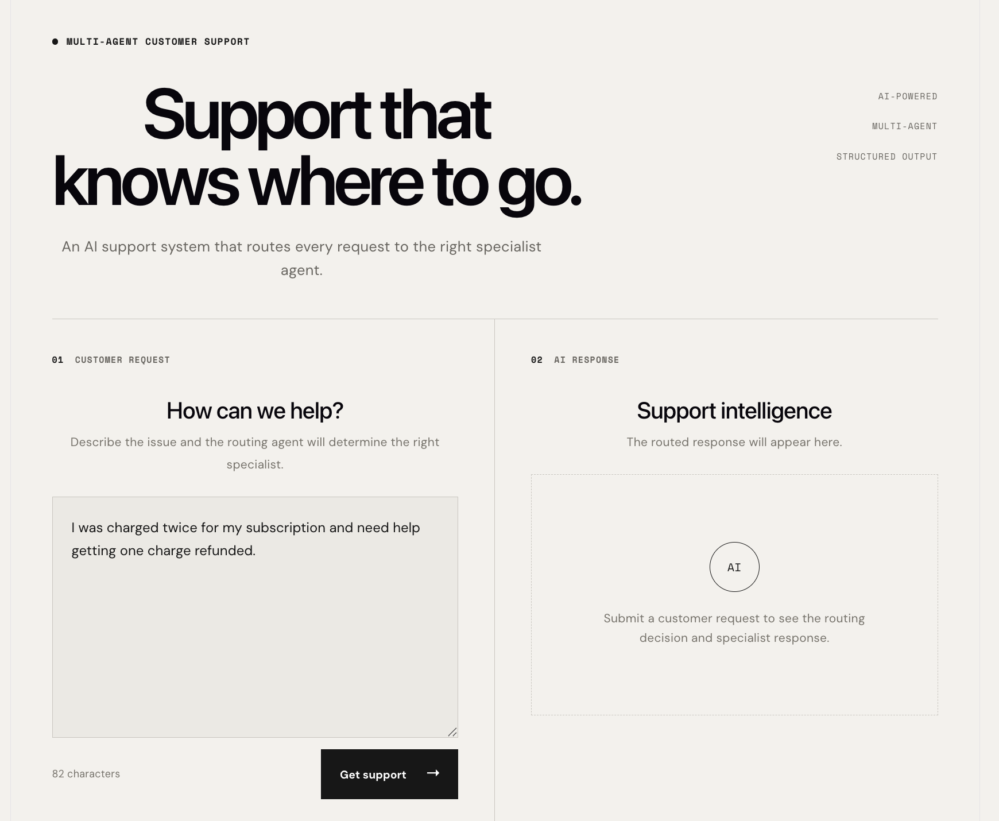
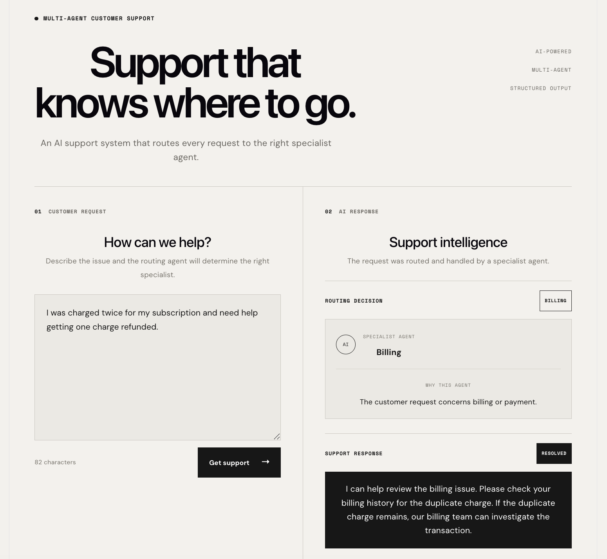

# Multi-Agent Customer Support

An AI-powered customer support system that routes incoming requests to the appropriate specialist agent and returns a structured response.



## What it does

- Classifies customer requests with a routing agent
- Routes requests to Billing, Technical, or General specialist agents
- Generates structured support responses
- Provides routing reasoning
- Tracks resolution and escalation status
- Supports demo mode and OpenAI-backed processing
- Exposes a FastAPI backend and React frontend

## Example



A request such as:

> I was charged twice for my subscription.

is routed to the **Billing Agent**, which returns the response together with the routing reasoning and resolution status.

A request such as:

I was charged twice for my subscription.

is routed to the Billing Agent, which returns the response together with the routing reasoning and resolution status.

## Architecture

```text
Customer Request
       ↓
   Router Agent
       ↓
 ┌─────┼─────────┐
 ↓     ↓         ↓
Billing Technical General
 Agent    Agent    Agent
 └─────┼─────────┘
       ↓
Structured Support Response

Tech Stack
Python 3.14
FastAPI
Pydantic
OpenAI API
React
Vite
pytest
uv
Run locally
Backend
uv run uvicorn app.main:app --reload
Frontend
cd frontend
npm install
npm run dev

Frontend: http://localhost:5173

Backend: http://localhost:8000

Testing
uv run pytest -v

35 tests passing.

Project focus

This project demonstrates practical Applied AI / LLM Engineering patterns including AI-based routing, specialist-agent orchestration, structured outputs, API integration, validation, and testable service architecture.


